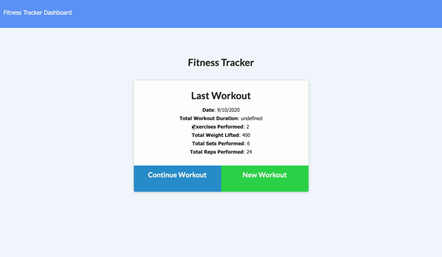

# Project Title 
### **Exercise Tracker**

## Description
An application used for logging and tracking your exercise progress.

Deployed app via Heroku: https://frozen-refuge-81665.herokuapp.com/

## Visuals

### Table of Contents
* [Usage](#Usage)
* [License](#License)
* [Contributing](#Contributing)
* [Questions](#Questions)

## Usage
This app can be used for tracking your exercise progress. Log past and future exercises to have a complete picture of your exercise trajectory and make adjustments where needed to hit your workout goals!

## License
MIT License selected. Click the badge above for further details.

## Contributing
Pull requests are welcome. For major changes, please open an issue first to discuss what you would like to change. Please make sure to update any tests where appropriate.

## Questions

Please reach out to the repo owner with any questions you may have.

- - -
© 2020 Rocco Losito. All Rights Reserved.